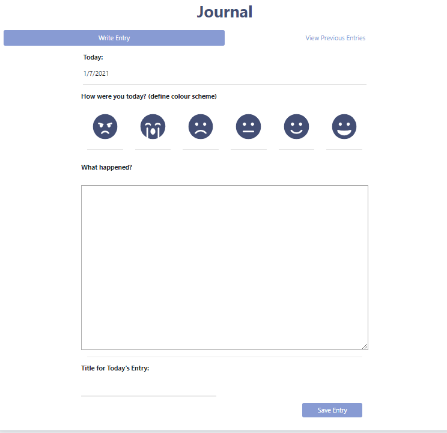
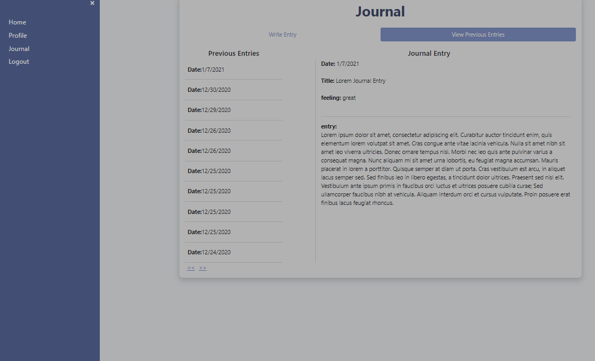
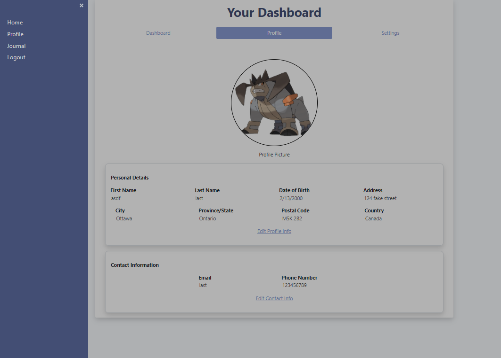

# <u>Project Focus</u>
Project focus is a microservice based journalling app which allows users to register, login, create/update their profiles, and as well as write in their journals. The focus of this project was to create a full stack web application that is separated into small(er) services as opposed to creating a monolithic service.

## <u>Demo</u>
Watch the youtube [demo](https://www.youtube.com/watch?v=a1uEq9twGnA)

## <u>To Run</u>
### Front-end
`npm run build`

The front end runs on `localhost:3001`

### Back-end
The back-end repository is located [here](https://github.com/andrewh-code/focus-scarlet-frostbite)

`$ node server/server.js` PORT=1234\
`$ node server_token/server_token.js` PORT=1235\
`$ node server_user_dashboard/server_user_dashboard.js` PORT=1236\
`$ node server_journal/server_journal.js` PORT=1237\

## <u>Microservices</u>
The following features were separated into their own containers/modules and separated as microservices

### User Registration/Authentication service
The service is focused on the creation and the registration of new users and as well as authenticating them. Authentication is done through JWT authentication. Once authenticated, a token is generated and sent back to the front end React application. The React application sends the JWT back to the back-end for authentication. User data (email, password (hashed), lastname, phone number, etc) are stored in a back-end PostgreSQL database.

### Authentication Service
The authentication service uses JWT authentication in order to authenticate existing users. It's the same service used in the registration service but separated into its own. This takes into account the use case where the registration service goes down. Even though new users cannot register themselves, existing users can still log into the web application using this service.

### Profile Editing/Updating
The profile editing/updating service interacts with the existing PostgreSQL database to update user information. Information includes the user's first name, last name, email, phone number, address, and emergency contact information.

### Journalling Service
The journalling feature was separated into its own service so it can directly connect and interact with a MongoDB database. The database was used as a document storage to store the journal entries. This microservice does not interact with the existing PostgreSQL database at all and is fully modular in itself. So just in case if the other services go down (except the authentication service), users can still log into the application and write their daily journal entry and as well as retrieve it.

## Tech Stack

### Front-end
- React (Hooks)
    - bootstrapped with [Create React App](https://github.com/facebook/create-react-app)
- Bootstrap
- CSS

### Back-end
- JavaScript (ES6+)
- Node.js
- Express.js
- PostgreSQL (Elephant SQL - Postgres As A Service)
- MongoDB (MongoDB as a service)

## <u>Screenshots</u>

__Journal Entry__

__Previous Entries__

__Profile Dashboard__

